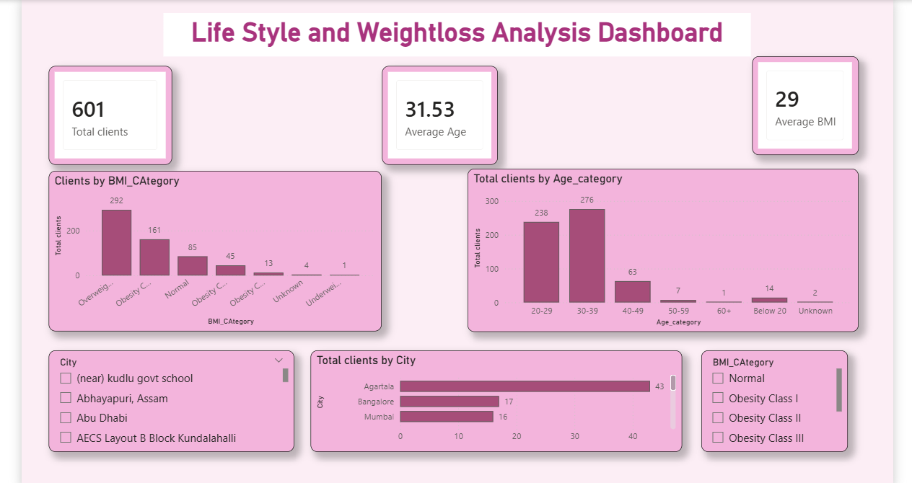
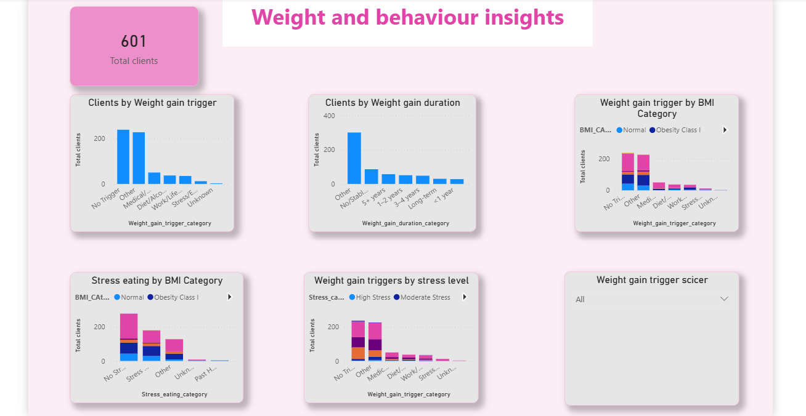
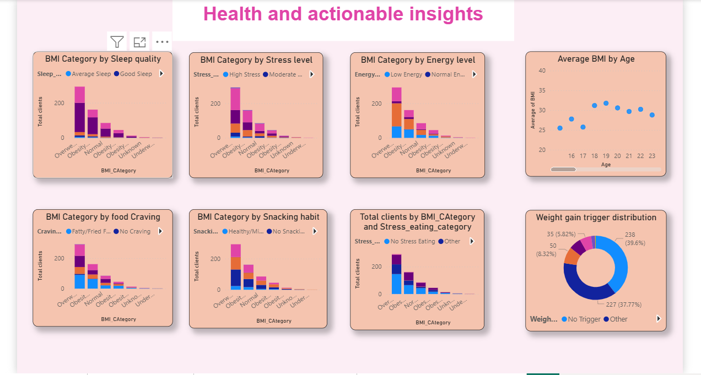

# Lifestyle & Weight Loss Analysis | Power BI

## Project Overview
This project analyzes a real-world lifestyle and weight-management dataset using Power BI. The objective is to understand patterns related to BMI, sleep, stress, energy levels, food cravings, snacking habits, stress eating, and weight-gain triggers.

The project demonstrates the complete process from raw survey data cleaning and transformation to interactive dashboard development and actionable insights.

## Dataset
- 601 client records
- Real-world lifestyle and weight-management survey data
- Includes age, height, weight, location, sleep, stress, energy level, food cravings, eating habits, and weight-gain information

## Data Cleaning & Transformation
Power Query was used to:
- Clean inconsistent height and weight values
- Calculate BMI
- Create BMI categories
- Create age categories
- Standardize sleep and stress responses
- Categorize energy levels
- Categorize food cravings and snacking habits
- Categorize stress-eating behaviour
- Categorize weight-gain triggers and duration
- Handle missing, inconsistent, and free-text responses

## Dashboard Pages

### 1. Client Overview
Provides an overview of the client population using total clients, average age, average BMI, BMI categories, age groups, and location.

### 2. Lifestyle Analysis
Analyzes sleep quality, stress level, energy level, food cravings, snacking habits, and stress eating.

### 3. Weight & Behaviour Insights
Explores weight-gain triggers, weight-gain duration, stress eating, BMI categories, and relationships between behavioural factors.

### 4. Health & Actionable Insights
Examines relationships between BMI and sleep, stress, energy, cravings, snacking, stress eating, age, and weight-gain triggers.

## Tools Used
- Power BI
- Power Query
- DAX
- Microsoft Excel

## Project Files
- `Lifestyle_Weightloss_PowerBI_Portfolio.pbix` – Complete interactive Power BI report

## Key Skills Demonstrated
Data Cleaning | Data Transformation | Data Visualization | Power Query | DAX | BMI Analysis | Lifestyle Analysis | Dashboard Design | Business Insights

## Dashboard Screenshots

### 1. Client Overview

### 2. Lifestyle Analysis

### 3. Weight & Behaviour Insights

### 4. Health & Actionable Insights

